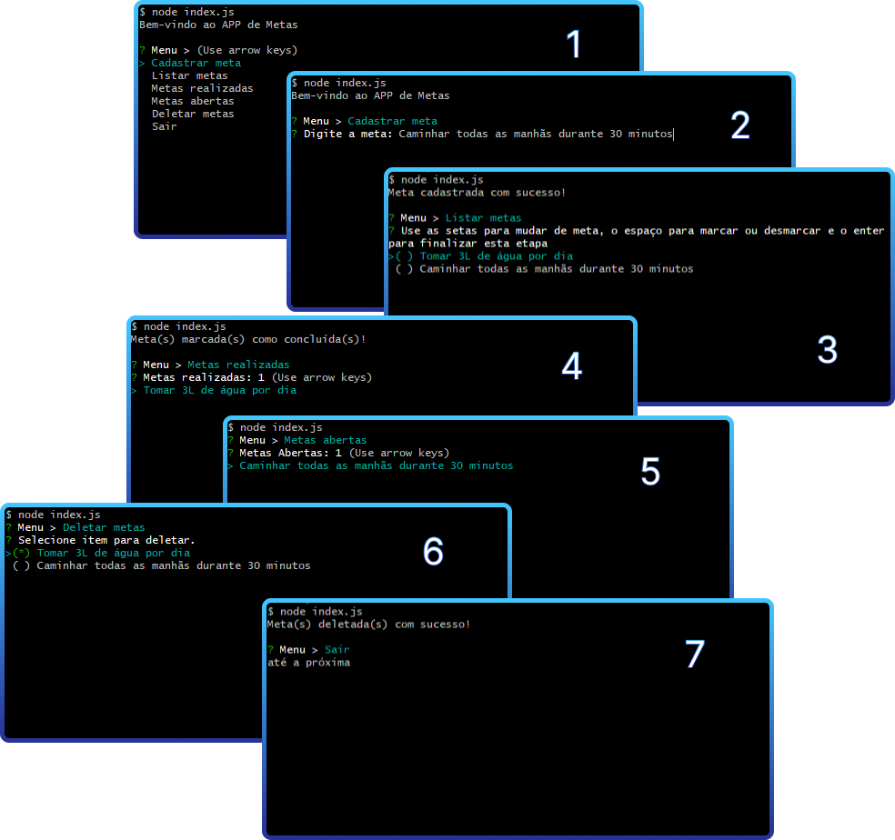

<h1 align="center">NLW-POCKET-JAVASCRIPT</h1>

Evento gratuito, promovido pela Rocketseat, onde foi desenvolvido um app de metas utilizando Javascript e NodeJS.

  <a href="#-tecnologias">Tecnologias</a>&nbsp;&nbsp;&nbsp;|&nbsp;&nbsp;&nbsp;
  <a href="#-projeto">Projeto</a>&nbsp;&nbsp;&nbsp;|&nbsp;&nbsp;&nbsp;
  <a href="#-layout">Layout</a>&nbsp;&nbsp;&nbsp;|&nbsp;&nbsp;&nbsp;
  <a href="#-licença">Licença</a>

  

 

  

## 🚀 Tecnologias

Esse projeto foi desenvolvido com as seguintes tecnologias:

## 💻 Projeto

Neste NLW-POCKET desenvolvemos um app de cadastro de metas, listagem (metas realizadas e abertas) e com opção de deletar. Este projeto é executado com NodeJS via terminal.

- [Acesse o repositório no Github](https://github.com/diegoespelho/nlw-pocket-js)

## 📝 Licença

Esse projeto está sob a licença MIT.
